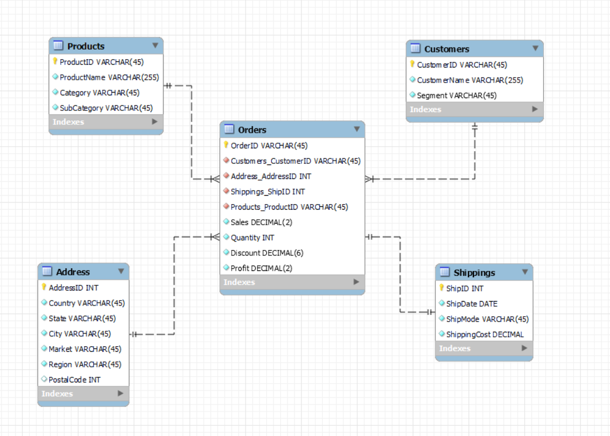
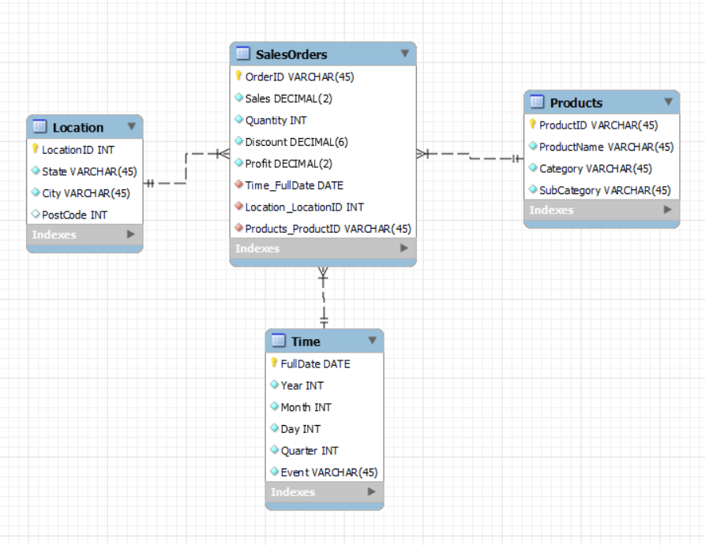

This folder holds all the files that solve the tasks in the Advanced Data Modeling course's graded assignments.

## Step 1

ER for Global Super Store database.

***global_super_store.mwb*** is the model file. You can import this into MySQL Workbench

## Step 2

***global_super_store.sql*** is the SQL script that is generated from Forward Engineer feature in MySQL workbench, which would create the entire database and relevant tables according to the planned ER.

## Step 3

ER which explain the dimensional data model to help with analyzing Global Super Store data in USA.

**Location**, **Products** and **Time** are dimensions tables; **SalesOrders** is the fact table.

## Step 4 - 7
You can access the interactive dashboard following this [URL](https://public.tableau.com/app/profile/eden.bui/viz/GlobalSuperStoreUSASales_17146688085150/SalesandProfitinUSA#1).

Or import the **Global Super Store USA Sales.twbx** file into your Tableau Desktop App to see the same dashboard.